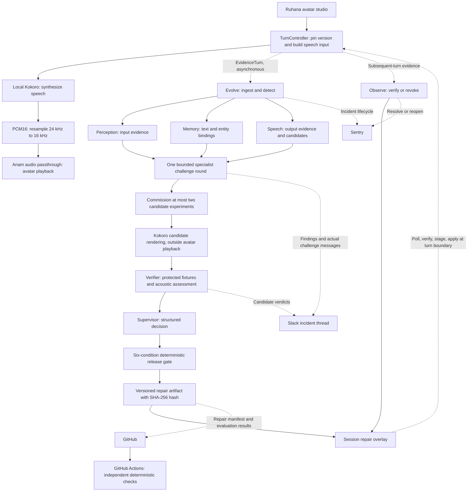

# Ruhana Evolve

### Self-healing voice and video agents, with evidence behind every repair.

> **Watch the demo on Loom**
>
> (https://www.loom.com/share/60e414f3a97a491b80e654c30ca6e72d)
>

Ruhana Evolve is a separately running reliability extension for **Ruhana AI**. It diagnoses a narrow class of voice-agent failures, tests possible repairs, and releases a scoped correction into the running conversation. Its three operational integrations are **Sentry, Slack, and GitHub**. Its live AI stack combines **Kokoro TTS, the Anam API, and the OpenAI API**, including **GPT-5.6 Terra** for candidate proposals and specialist discussion.

The demonstration starts with an agent that displays the correct name but pronounces it incorrectly. Evolve investigates the input, entity binding, and speech layers; renders candidate pronunciations; challenges them against protected fixtures; and applies a verified repair at a subsequent turn boundary. A fresh sentence demonstrates the change. Regression handling can revoke the repair and reopen the incident automatically.

**No human approval is required inside the implemented repair loop.** Release authority belongs to a deterministic gate, with explicitly limited repair types and scope.

**Verified locally:** 115 tests across 13 files, TypeScript checking, and 12/12 deterministic evaluation scenarios passed on September 14, 2026. Live Kokoro synthesis, OpenAI-backed repair, Anam avatar playback, and writes to all three operational apps were exercised separately during the local demo.

[Architecture](#architecture) · [Apps and models](#apps-and-models) · [Technical implementation](#technical-implementation) · [Run locally](#run-locally) · [Demo walkthrough](#demo-walkthrough) · [Verification](#verification) · [Implementation scope](#implementation-scope)

## The problem

A transcript can look perfect while the customer hears a mistake. The same apparent name error can originate in several different places:

| Layer | Example failure | Evidence needed to investigate it |
|---|---|---|
| Recognition | The caller says a name, but the recognizer writes a different word. | Microphone audio and a separate decode. |
| Entity binding | The text resolves to the wrong registered person. | Transcript, selected entity, and canonical registry records. |
| Speech synthesis | The intended text is correct, but its speech representation produces the wrong pronunciation. | Intended text, submitted speech segments, rendered audio, and reference pronunciation. |
| Runtime delivery | An older response survives after a newer turn supersedes it. | Turn identity, version snapshot, and delivery events. |

Changing a prompt without locating the responsible layer can preserve the original error or introduce another one. Evolve makes the proposed intervention explicit: **which entity, which speech representation, which runtime version, and which tests justify changing it?**

The current end-to-end demonstration focuses on **session-scoped pronunciation repair**. Recognition and entity-binding investigation, and runtime fault detection, provide additional diagnostic lanes; they should not be confused with fully implemented automatic repair for every failure class.

## Architecture

The conversation runtime and the repair service are separate processes. The runtime synthesizes and delivers speech while evidence travels asynchronously to Evolve. Repair investigation and external app writes stay outside the normal response path.



The diagram shows logical flow. External integrations are invoked through the app write queue; their availability does not determine whether an already verified session repair can activate. GitHub Actions runs independently after repository events; the current session release does **not** wait for CI.

### Two contracts connect the extension to the runtime

| Direction | Endpoint | Purpose |
|---|---|---|
| Runtime → Evolve | `POST /api/evidence/turn` | Submit per-utterance evidence; receive `{ accepted, duplicate }`. |
| Runtime ← Evolve | `GET /api/session/{session_id}/repairs` | Retrieve the current versioned repair overlay. |

The shared [TypeScript contracts](contracts/types.ts) preserve tenant, session, turn, and utterance identity; the effective version; entity references; intended text; submitted speech segments; optional audio links; delivery events; and explicit fault-injection labels. Round-trip tests use the actual HTTP client and server to check compatibility.

The runtime posts evidence without awaiting it in the speech response path. The HTTP service starts candidate investigation in the background after ingestion. Ingestion can itself await observation of an existing repair; this does not block speech delivery because the runtime's evidence submission is asynchronous.

## Apps and models

### The three operational apps

Each app has a distinct engineering responsibility and receives actual API writes when configured.

| App | Role in the system | What a judge can inspect |
|---|---|---|
| **Sentry** | Incident lifecycle. Evolve opens a fingerprinted issue for a detected discrepancy, resolves it after a successful subsequent-turn observation, and reopens it after rollback. | Incident identity, suspected failure layer, observed version, seeded-fault label, and lifecycle changes. |
| **Slack** | Shared investigation workspace. Specialist findings, their challenge messages, verifier counterexamples, and the release decision appear in one incident thread under named roles. | What each specialist reported, what could disprove it, where another specialist challenged it, and which candidate the verifier rejected. |
| **GitHub + GitHub Actions** | Versioned repair evidence and independent repository checks. Evolve commits a redacted manifest under `repairs/<incident>/<repair>.json`; Actions runs typechecking, tests, and the protected evaluation suite. | Repair scope and payload, predecessor, artifact hash, candidate verdicts, fixture outcomes, commit history, and the CI evaluation artifact. |

Slack displays the real structured exchange produced inside Evolve. The orchestrator passes findings between specialists directly; it does not poll Slack messages to control execution. This preserves an inspectable workspace while allowing a repair to proceed during a Slack outage.

GitHub records the generated repair package. The implemented correction is a runtime overlay, so the application does not need a new deployment for each name repair. Arbitrary source-code generation and automatic application redeployment are outside this prototype's implemented release path.

Connector implementations: [apps/connectors.ts](evolve/src/apps/connectors.ts). Ordering, retries, and outcomes: [apps/queue.ts](evolve/src/apps/queue.ts).

### Voice, avatar, and intelligence stack

| Technology | Current role | Implementation detail |
|---|---|---|
| **Kokoro / Kokoro-82M** | Controllable local speech synthesis for both user-facing speech and candidate experiments. | Python worker using `KPipeline`, the `af_heart` voice, and explicit phoneme markup. Generates 24 kHz mono audio. |
| **Anam API + JavaScript SDK** | Real-time avatar rendering and playback of the audio Evolve controls. | Server creates an audio-passthrough session; the browser streams mono 16 kHz `pcm_s16le` through Anam's agent audio input. |
| **OpenAI API — GPT-5.6 Terra** | Speech candidate proposals and the bounded specialist challenge round. | Configured as `gpt-5.6-terra` through `EVOLVE_SPECIALIST_MODEL`; text requests use the Responses API. |
| **OpenAI API — GPT-5.6 Luna** | Supervisor decision over findings, candidates, and verifier results. | Default `EVOLVE_SUPERVISOR_MODEL=gpt-5.6-luna`; its requested release remains subject to code guardrails and the gate. |
| **OpenAI API — audio judge** | Assess synthesized candidate audio for target pronunciation and collateral changes. | Default `EVOLVE_JUDGE_MODEL=gpt-audio-1.5`; audio is sent through the audio-capable Chat Completions path. |
| **OpenAI API — transcription** | Independent decode when real microphone audio is supplied. | Default `EVOLVE_STT_MODEL=gpt-4o-transcribe`. Synthetic demo microphone URLs use a clearly identified scripted decoder. |
| **TypeScript, Node.js, Vitest** | Runtime control, contracts, orchestration, connectors, and verification. | Provider interfaces separate network-backed components from deterministic test doubles. |

These model IDs describe this repository's configured defaults. They are environment-configurable and require access on the account running the demo. The role assignment is explicit in [scenario.ts](evolve/src/scenario.ts), and API requests live in [providers/llm.ts](evolve/src/providers/llm.ts) and [providers/audio-judge.ts](evolve/src/providers/audio-judge.ts).

Kokoro runs locally without a hosted TTS API key. The credential-free evaluation path makes no model API calls. Live OpenAI and Anam usage depends on the account's credits, access, and billing; this README does not describe the full live stack as free.

## Technical implementation

### 1. Evidence isolation before specialist discussion

The three specialists receive different evidence views, constructed in [agents/protocol.ts](evolve/src/agents/protocol.ts):

| Specialist | Evidence available during its initial inspection | Initial implementation |
|---|---|---|
| Perception | Microphone audio, primary transcript, and registry candidates. No intended response or generated output audio. | Independent decoder plus structured comparison; abstains if audio or decoding is unavailable. |
| Memory | Transcript text, intended response, current entity bindings, and registry candidates. No audio or speech phonemes. | Deterministic binding and reference checks. |
| Speech | Intended text, speech segments, rendered output, target reference, and neighboring words. No microphone track or primary transcript. | Audio assessment plus Terra-backed phoneme candidate proposals. |

Initial inspections run concurrently. Only afterward does [the challenge round](evolve/src/agents/discussion.ts) expose the other specialists' conclusions. Each participating specialist produces a short structured reply with a stance of `agree`, `challenge`, `refine`, or `defer`. Cited evidence IDs are filtered against evidence that specialist actually inspected.

The round is bounded to one exchange, with at most two commissioned candidate experiments. Agreement is not a gate condition. The recorded messages are explicit model outputs, rather than invented descriptions of hidden reasoning. The current supervisor decision consumes findings and verdicts; the challenge transcript is retained for inspection and is not itself an authorization signal.

### 2. Repair the speech representation while preserving display text

The repair targets an entity's phonemes. It preserves the text that the user sees and the semantic identity of the entity.

For the synthetic demo entity, the speech builder can turn:

```text
Good morning Ayesha, your order is ready.
```

into structured segments:

```json
[
  { "kind": "text", "text": "Good morning " },
  {
    "kind": "phoneme",
    "display": "Ayesha",
    "phonemes": "/ɑːˈjeɪʃə/",
    "entity_id": "demo-person-17"
  },
  { "kind": "text", "text": ", your order is ready." }
]
```

The reference above is a **synthetic demo preference**, not a universal pronunciation of the name. A production registry would need a trustworthy, person-specific reference.

[buildSpeechInput](runtime/src/speech-input.ts) performs whole-word substitution for the scoped entity. The [Kokoro worker](runtime/workers/kokoro/worker.py) translates phoneme segments into Misaki's explicit-phoneme markup. Neighboring words continue through the engine's normal text-to-phoneme processing.

The same worker exposes two paths:

- `POST /synthesize`: produces PCM16 for the live runtime.
- `POST /render`: produces a WAV file and metadata for an experiment. It rejects a requested voice/model version that does not match the worker.

Candidate audio is evaluated outside the avatar stream. A customer does not hear the alternative experiments while they are being tested.

### 3. Adversarial verification through the real runtime code

The [verifier](evolve/src/agents/verifier.ts) calls the runtime's actual speech-input builder. This checks whether a candidate works through the same transformation that will later apply it.

The [protected fixture set](fixtures/protected/pronunciation.fixtures.json) contains six required cases:

| Fixture | What it protects |
|---|---|
| Original failing sentence | The proposed repair fixes the reproducer. |
| New sentence | The repair applies outside the proposal's original sentence. |
| Name at a different position | Punctuation and sentence position do not prevent application. |
| “Our Asia team…” | Unrelated words remain untouched. |
| “Ayesha and Aisha…” | A neighboring registered person retains a distinct identity. |
| Name without a reference | The system leaves unsupported pronunciations alone. |

Verification reconstructs the display text, checks entity containment, tests required pronunciations, and looks for collisions with neighboring entities. Candidates that fail required fixtures are refuted before release.

For local Kokoro, the worker reports the explicit phoneme segments it submitted as `rendered_tokens`. The verifier checks these against the reference and consults the audio judge for collateral changes. **This metadata establishes the requested synthesis control; it is not an independent acoustic measurement of the emitted waveform.** When token metadata is absent, fixture verification uses the audio judge's match threshold, currently `0.8`, alongside the structural checks. Judge scores are experimental signals, not calibrated probabilities of correctness.

### 4. A supervisor can recommend; the machine gate decides

The [supervisor](evolve/src/agents/supervisor.ts) produces a structured decision. Code prevents it from choosing a candidate the verifier refuted or widening the repair beyond the incident's scope.

Every requested release then reaches [evaluateGate](evolve/src/domain/gate.ts). All six conditions must pass:

| Condition | Release requirement |
|---|---|
| 1. Allowed type and scope | The repair type is permitted and its tenant/entity matches the incident's allowed scope. |
| 2. Evidence present | Referenced evidence records exist and can be resolved. |
| 3. Required checks passed | The verifier did not refute the candidate, every required fixture ran, and no fixture failed. |
| 4. Protected content untouched | The payload contains only the declared repair fields; it cannot change reference data, tests, permissions, or gate settings. |
| 5. Base version unchanged | Evidence was collected against the current base version. A stale diagnosis cannot be released onto a different base. |
| 6. Expiry and predecessor | The repair has a bounded lifecycle and any predecessor reference is known. Current releases expire with the session. |

The gate does not consult the supervisor's self-reported confidence. All conditions are evaluated so the record explains the complete release decision.

### 5. Versioned activation without changing a turn halfway through

Each turn pins an effective version such as:

```text
base-1+overlay.0   original session state
base-1+overlay.1   a verified repair is active
base-1+overlay.2   a later overlay, possibly with that repair removed
```

The runtime polls for repairs every second in the demo. [SessionOverlayStore](runtime/src/overlay.ts) verifies and stages a newer overlay, then applies it only at the next turn boundary. Tenant, entity, and session checks determine where a repair can take effect.

This means **the first turn after a repair has been verified and received** can use it. The system does not promise to finish a multi-model investigation before the user's immediately following turn.

[TurnController](runtime/src/turn-controller.ts) also uses a monotonically increasing turn epoch. If a newer turn or interruption supersedes an in-flight response, the old response is recorded as superseded and withheld from delivery. Browser microphone/VAD integration is a separate, unfinished part of the full voice-input experience.

### 6. Repair artifacts carry integrity and provenance

Each issued artifact includes a repair ID, scoped payload, base and overlay versions, expiry, predecessor, and SHA-256 hash over canonical JSON. The runtime and service share [the hashing implementation](contracts/artifact.ts), including the overlay version at which the repair was issued.

A mismatched hash causes the runtime to reject the whole overlay. The hash detects inconsistent or modified content; it is **not a digital signature or authenticated proof of issuer identity**. For backward compatibility, the current runtime still accepts repairs without hashes. Mandatory authenticated artifacts are a production-hardening step.

GitHub manifests retain the issued repair and candidate evaluation results. External records redact known registry names and recognition hints. This is targeted redaction rather than a general-purpose PII detection system; raw audio is not placed in the Slack, Sentry, or GitHub records.

### 7. Observe the next output, then resolve or roll back

Release begins observation. When a later turn includes the repaired entity and its pronunciation override, Evolve checks it again. A successful observation resolves the incident. A detected regression removes the repair, quarantines the entity, and enqueues a Sentry reopen.

Rollback publishes a **higher overlay version with the repair removed**. Sending an older version would fail because the runtime intentionally ignores stale overlays. This preserves monotonic versioning while reversing a behavioral change.

The current observer re-renders the recorded `speech_input` through the configured renderer. It does not analyze audio captured from the listener's device or measure browser playback timing. It verifies reproducible synthesis behavior, with end-to-end playback telemetry remaining an extension point.

### 8. External service failures do not block a verified repair

The [app write queue](evolve/src/apps/queue.ts) assigns jobs incident/repair-specific keys, retries failures up to four times, and records their outcomes. Jobs for the same incident stream execute in order; unrelated streams can proceed concurrently.

Ordering matters: a Slack reply needs its parent thread, and a Sentry reopen must not race ahead of the resolution that preceded it. GitHub writes look up an existing file before updating it.

The queue and its deduplication ledger are currently in memory. These are useful process-local guarantees, not a claim of durable exactly-once delivery across crashes or ambiguous network failures.

### 9. The proposer cannot rewrite its evaluation through the repair API

Reference records are exposed through a read-only registry interface to the repair components. Candidate payloads cannot carry new fixtures or gate settings. The GitHub connector writes generated manifests under `repairs/`.

[GitHub Actions](.github/workflows/protected-fixtures.yml) independently runs the tests and evaluation. Its guard rejects a checked commit that changes both a repair manifest and protected fixture/workflow paths. This is a concrete repository check; production branch protection and credential restrictions are still required to make the wider repository boundary enforceable.

## Run locally

### Option A: inspect the repair system without credentials

Prerequisite: **Node.js 22+**, matching the CI runtime, and npm.

```bash
npm ci
npm test
npm run typecheck
npm run evolve:demo
npm run evolve:eval
```

The default CLI demo and evaluation use deterministic providers. They reproduce the orchestration, rejection, release, and rollback paths without OpenAI, Anam, or app credentials. The evaluation prints provider provenance before its results.

### Option B: run the live avatar and connected apps

You need Node.js, **Python 3.11** as used in the local demo, network access for model downloads/API calls, and credentials for the live services you enable.

1. Install JavaScript dependencies with `npm ci`.
2. Copy `.env.example` to `.env` and fill in the configuration below. Do not overwrite an existing configured `.env`; it is intentionally gitignored.
3. Install the Python worker dependencies. Run this inside your preferred Python environment:

```bash
python -m pip install kokoro==0.9.4 fastapi uvicorn numpy
```

The worker initializes Kokoro on first synthesis, so the first request may include model download and warm-up time. The demo uses `kokoro-82M:af_heart`; keep the worker voice, registry, and protected fixture voice version aligned.

Start these in three terminals, all from the repository root:

```bash
# Terminal 1: local speech engine
python runtime/workers/kokoro/worker.py
```

```bash
# Terminal 2: repair service and engineering dashboard
npm run evolve:serve
```

```bash
# Terminal 3: Ruhana-branded avatar studio
npm run web
```

| Surface | Local URL |
|---|---|
| Avatar studio | [http://localhost:4900](http://localhost:4900) |
| Evolve dashboard | [http://localhost:4830](http://localhost:4830) |
| Evolve health | [http://localhost:4830/health](http://localhost:4830/health) |
| Kokoro health | [http://127.0.0.1:8880/health](http://127.0.0.1:8880/health) |

The browser gets an Anam session token from the server; the Anam API key remains server-side. Kokoro's PCM is resampled from 24 kHz to 16 kHz and sent to Anam in approximately 250 ms chunks. The avatar studio also supports local audio playback when no avatar session is connected.

### Environment configuration

| Variables | Purpose |
|---|---|
| `ANAM_API_KEY`, `ANAM_AVATAR_ID` | Create the live Anam passthrough session. |
| `OPENAI_API_KEY` | Enable the configured text models, acoustic judge, and real independent decoder. |
| `EVOLVE_SPECIALIST_MODEL=gpt-5.6-terra` | Candidate proposals and challenge messages. |
| `EVOLVE_SUPERVISOR_MODEL=gpt-5.6-luna` | Structured supervisory decisions. |
| `OPENAI_REASONING_EFFORT=low` | Reasoning effort for text model requests. |
| `EVOLVE_JUDGE_MODEL=gpt-audio-1.5` | Audio assessment model. |
| `EVOLVE_STT_MODEL=gpt-4o-transcribe` | Independent transcription model. |
| `KOKORO_URL=http://127.0.0.1:8880` | Enable real candidate rendering in Evolve and speech in the avatar runtime. |
| `SENTRY_DSN`, `SENTRY_AUTH_TOKEN`, `SENTRY_ORG`, `SENTRY_PROJECT` | Sentry event ingestion and issue lifecycle updates. |
| `SLACK_BOT_TOKEN`, `SLACK_CHANNEL_ID` | Post the investigation into a Slack channel. |
| `GITHUB_TOKEN`, `GITHUB_REPO`, `GITHUB_BRANCH` | Commit repair manifests to `owner/repository`, on the selected branch. |
| `EVOLVE_URL`, `WEB_PORT`, `PORT` | Optional service/address overrides; defaults are ports 4830 and 4900. |

The sample environment also contains fields inherited from broader Ruhana work. **Firecrawl, Supabase, and `ANAM_VOICE_ID` are not required by this demo's current live path.** The active store is in memory. Groq/Gemini provider adapters exist in source, but the default live wiring in `buildWorld()` selects OpenAI; adding their keys alone does not switch that wiring.

### Connect the three apps

1. **Sentry:** create a project, copy its DSN, and configure an API token with the project-read and event-administration access required by the connector. Use organization and project slugs in the environment variables.
2. **Slack:** create/install a bot with `chat:write`, invite it to your demo channel, and copy the channel ID. `channels:read` for public channels or `groups:read` for private channels lets the connection checker verify membership. `chat:write.customize` supports separate display names for specialist posts; the connector also labels speakers in message text.
3. **GitHub:** select a repository/branch and grant the token repository contents read/write access. Keep the workflow and fixtures in the repository so Actions can independently evaluate commits. Scope the token to the intended demo repository.

Verify the configured app connections:

```bash
npm run evolve:check
```

This command checks credentials, resource reachability, and relevant configuration. A successful read check is not a substitute for inspecting the actual write outcomes in the dashboard. Live demo execution with app credentials creates real Slack messages, Sentry records, and GitHub manifest commits.

## Demo walkthrough

### Recommended Loom take: avatar-led repair

Open the avatar studio, Evolve dashboard, and the corresponding Slack, Sentry, and GitHub pages before recording. Include computer audio in the Loom recording.

| Step | Action | Evidence to show |
|---|---|---|
| 1. Introduce the system | Show Ruhana's avatar and explain that Evolve is a separate repair service. | Two local surfaces: the user experience and the engineering view. |
| 2. Produce the fault | Start the avatar session, arm the seeded fault, and speak “Good morning Ayesha, your order is ready.” | Audible baseline, unchanged display text, and the explicit fault label in session activity. |
| 3. End fault injection | Click **Disarm fault** after the failing turn. | This only stops deliberate fault injection; it neither selects nor approves a repair. Leaving it armed would keep discarding even a valid override. |
| 4. Inspect the investigation | Switch to the dashboard and Slack while Evolve runs. | Separate findings, actual challenge messages, candidate results, and any rejected alternative. With avatar-only input, perception correctly reports unavailable microphone evidence. |
| 5. Inspect release | Wait for the repair to be released. | The gate's six conditions, issued artifact, and session overlay. Live timing depends on synthesis and API latency. |
| 6. Prove a new output | Return to the avatar, enter “Ayesha, your appointment is confirmed.” and click **Speak**. | A newly synthesized sentence, the updated effective version, and its phoneme segment in session activity. |
| 7. Close the evidence trail | Inspect the dashboard and external records after writes settle. | Subsequent-turn observation, Sentry resolution, Slack decision, and the GitHub manifest/evaluation. |

The core demonstration is stronger when judges can follow one incident ID across the three apps and compare what was proposed, rejected, released, and observed. The synthetic failing case is intentionally labeled; the live candidate rendering and API calls remain real.

### Dashboard-only replay and rollback

For a separate guided take, the dashboard exposes **Seed the failing turn**, **Speak a new sentence**, and **Force a regression**. These submit synthetic evidence through the same ingestion and observation logic. In live mode, the configured renderer and judge still run; the buttons do not themselves play avatar audio.

`npm run evolve:demo` provides a credential-free narrated demonstration of candidate rejection and rollback. `npm run evolve:demo -- --live` uses available live providers and configured app connectors. Use the printed provider provenance to identify which components actually ran live.

**Repeatability:** the current demo uses a fixed tenant/session, and dashboard controls use fixed turn IDs. Restart both Node services and reload the avatar page for a clean take; the model worker can stay warm. Use either the avatar-led sequence or the dashboard-led sequence in a take to avoid duplicate evidence IDs. Restarting resets the in-memory session and incident state, but does not delete existing external app records.

## Verification

The current checkout passed the following on **September 14, 2026**:

| Check | Result | What it establishes |
|---|---|---|
| `npm test` | **115/115 tests; 13/13 files** | Contracts, speech segmentation, PCM handling, Anam session configuration, scoped overlays, artifact validation, orchestration, challenges, app behavior, and regression handling. |
| `npm run typecheck` | **Passed** | Shared TypeScript contracts and implementation compile consistently. |
| `npm run evolve:eval` | **12/12 scenarios** | Predefined orchestration expectations hold under deterministic providers. |
| Separate local live demo | **Exercised** | Kokoro rendering, OpenAI text/audio calls, Anam avatar speech, and successful configured app writes. |

The evaluation covers detection, layer localization, bounded candidates, harmful-candidate rejection, all six gate conditions, a fresh utterance, negative controls, missing references, rollback, duplicate evidence, superseded turns, and stale-version rejection.

Deterministic evaluation timing uses a fake clock. It is not a latency benchmark. These designed cases establish tested behavior rather than a measured real-world success rate. For live verification, inspect provider names, candidate audio provenance, fixture verdicts, and app write outcomes alongside the Loom recording.

## Implementation scope

Evolve demonstrates **automatic runtime adaptation through verified session overlays**. It does not update model weights. Its retained GitHub manifests provide an audit trail; cross-session retrieval and promotion of learned repairs are not implemented yet.

| Area | Current implementation | Next engineering step |
|---|---|---|
| Pronunciation healing | End-to-end scoped proposal, rendering, verification, release, and observation. | Broader languages, entities, and real reference-recording evaluation. |
| Recognition and binding | Separate diagnostic lanes and an `entity_rebinding` contract. | Wire entity rebinding into the full response-generation path and validate microphone-led repairs end to end. |
| Input and playback evidence | Evidence schema, transcriber adapters, synthesized audio, and turn events. | Browser microphone/VAD capture, retained listener-side output, and measured playback events. |
| Reference truth | Synthetic registry phonemes and placeholder reference identifiers. The OpenAI judge receives candidate audio and reference phonemes. | Private reference recordings and a calibrated independent evaluation pipeline. |
| Persistence | In-memory evidence, incidents, overlays, and job ledger; external repair manifests. | Durable database, queue/outbox, restart recovery, and artifact replay. |
| Isolation and access | Runtime scope checks and closed repair payloads. Demo uses tenant `demo`, session `s-42`. | Authentication, authorization, validated multi-tenant routing, and request/resource limits before public exposure. |
| Artifact trust | Canonical SHA-256 verification; unsigned artifacts tolerated for compatibility. | Mandatory authenticated artifacts and issuer verification. |
| Deployment | Separate local runtime, Evolve service, and Python worker. | Packaging, supervised services, protected audio storage, and production monitoring. |
| Continual improvement | Repairs affect subsequent turns within a session. | Evidence-based cross-session reuse and tenant-wide promotion with revalidation. |

These boundaries keep the demo reviewable: judges can distinguish working code from the longer-term extension design.

## Repository guide

```text
contracts/
  types.ts                         Shared evidence and repair contracts
  artifact.ts                      Canonical serialization and SHA-256 verification
  mocks/                           Contract-compatible deterministic service
runtime/
  src/turn-controller.ts           Version-pinned turns and supersession handling
  src/overlay.ts                   Staging, integrity checks, and scoped activation
  src/speech-input.ts              Entity-scoped speech segment construction
  src/anam/                       Passthrough session configuration
  src/audio/                      PCM conversion and resampling
  src/tts/                        Speech engine adapters
  src/stt/                        Transcription adapters
  web/                            Ruhana-branded avatar studio and HTTP server
  workers/kokoro/worker.py         Local synthesis and experiment rendering
  test/                           Runtime verification
evolve/
  src/orchestrator.ts              Investigation, release, observation, rollback
  src/agents/                     Specialists, challenge protocol, verifier, supervisor
  src/domain/                     Detection, registry, gate, artifacts, overlays
  src/providers/                  Real providers and deterministic test doubles
  src/apps/                       Sentry, Slack, GitHub, ordered write queue
  src/api/                        Evidence API, repair API, dashboard endpoints
  src/eval/                       Deterministic scenario evaluation
  web/                            Engineering dashboard
  test/                           Gate, discussion, integration, connector tests
fixtures/protected/               Predefined reproducer and regression fixtures
repairs/                          Recorded repair manifests
.github/workflows/                Independent CI verification
```

For a focused code review, start with [orchestrator.ts](evolve/src/orchestrator.ts), [verifier.ts](evolve/src/agents/verifier.ts), [gate.ts](evolve/src/domain/gate.ts), [overlay.ts](runtime/src/overlay.ts), and [the protected fixtures](fixtures/protected/pronunciation.fixtures.json).

The [project design document](RUHANA-EVOLVE-PROJECT.md), [integration notes](INTEGRATION.md), and component READMEs provide additional development context. Some contain earlier milestone descriptions; this README's implementation scope reflects the current reviewed code.
