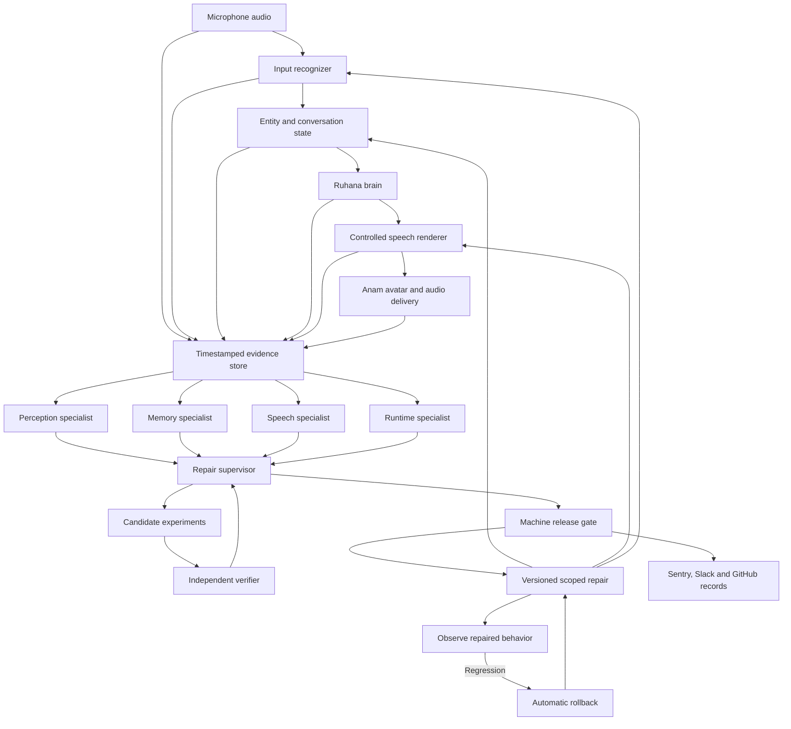

# Ruhana Evolve: autonomous repair for voice and video agents

**Research and architecture proposal — September 13, 2026. Planning only.**

This document specifies a separately deployed extension that observes Ruhana's speech pipeline, diagnoses failures with specialist agents, tests repairs, and activates successful changes automatically. The intended product has no operator approval step in its repair loop. This proposal does not authorize implementation or deployment. The existing application, paused scaffold, and Flour and Go installation remain untouched.

**Product thesis:** Ruhana should learn from the difference between what someone said, what its recognizer heard, what its brain intended, and what its avatar actually spoke. Evolve converts that difference into a scoped, tested change at the responsible component.

**Flagship capability:** an avatar can display the correct name while pronouncing it incorrectly. Evolve hears the generated audio, isolates a synthesis failure, produces and tests a pronunciation repair, and uses it in a new utterance during the same conversation. Recognition mistakes have a separate repair path. Verified improvements persist with evidence and automatic rollback.

The proposed contribution is an integration and engineering design. It is not an established world-first algorithm, a demonstrated production system, or a claim that proprietary foundation-model weights can be retrained through an API.

## 1. What the research changes

### Competitive reality

| Product or research effort | What public material establishes | Implication for Evolve |
|---|---|---|
| Lemma | Production traces become issues; investigation connects to Slack and coding agents, proposed changes, and subsequent evaluation. | Generic detection, prompt fixes, PRs, and monitoring are already part of its positioning. The reviewed public material does not document audio-grounded, within-call pronunciation repair. That is a public-documentation finding, not proof about private capabilities. |
| Rasen | Explicitly targets continual improvement across STT, LLM, and TTS using production conversations. Its site presents an early-access research product. | “Voice agents that learn from production” alone is not a novel claim. Public marketing does not establish the reliability or latency of a comparable deployed loop. |
| Roark | Documents audio evaluation, pronunciation problems, replay, and suggested changes to prompts, models, voices, and infrastructure. Its self-improvement page describes customer review and application of proposed changes. | Pronunciation scoring and finding voice failures are already competitive features. Automatic selection, activation, and verification of a repair are the stronger demonstration. |
| Hamming and Coval | Offer voice testing, simulations, and production evaluation or monitoring. | A dashboard of failed calls and generated tests is insufficient differentiation. |

Sources: the companies' own product pages.[^1][^2][^3][^4][^5][^6]

The strongest defensible positioning is:

> **An autonomous repair harness that compares input audio, recognized text, intended meaning, and emitted speech; runs experiments at the suspected boundary; and activates verified repairs during a conversation.**

“Master agent with specialist agents” is an architecture pattern, not the invention. The valuable work is the audio evidence, repair interfaces, controlled experiments, persistent learning, and enforcement around release.

### Research foundations and their limits

GEPA provides a relevant model for proposing changes from rich failure feedback and selecting candidates through evaluation. ACE provides a relevant model for accumulating structured, incremental context instead of repeatedly rewriting a giant prompt. Evolve can borrow these principles without claiming to implement either full research system in three hours.[^7][^8]

Research on self-correction is mixed. Huang and colleagues found important failures when models corrected reasoning without external feedback. Liu and colleagues report intrinsic correction under different prompting and sampling conditions. These results concern particular reasoning experiments; neither establishes reliable voice repair. Our design therefore adds evidence from the actual audio and executable checks.[^9][^10]

Multi-agent discussion also needs qualification. Du and colleagues report benefits from debate, while the more recent *Cost of Consensus* reports harmful consensus effects in its homogeneous, smaller-model experiments. Neither result transfers automatically to this application. Specialists should inspect evidence independently before exchanging concise challenges; agreement is not itself a release criterion.[^11][^12]

AlphaEvolve and the Darwin Gödel Machine demonstrate substantial precedents for automated program improvement using evaluation. Broad self-improving code is therefore also an existing research direction. Evolve's code lane should target voice adapters with measurable contracts.[^13][^14]

## 2. The actual problem: four representations can disagree

The system must preserve the boundaries in this chain:

**Original microphone audio → recognized words → resolved entities and intent → intended response text → synthesized audio → delivered avatar output**

Each arrow can introduce a different error.

| Failure | Required evidence | Correct repair target | Inappropriate shortcut |
|---|---|---|---|
| Input recognition | Original user clip says a name differently from the recognizer's result. | Re-decode the clip; add a scoped recognition hint or entity-resolution rule. | Assume every unusual transcript is wrong. |
| Entity or memory | Transcript identifies the right person, but the response uses another name. | Correct the session entity binding and validate the next draft against it. | Change the TTS voice. |
| Pronunciation | Intended response contains the right name, but emitted audio differs from the reference pronunciation. | Repair phonemes or provider pronunciation instructions; render and evaluate new audio. | Keep rewriting the brain prompt while leaving synthesis untouched. |
| Runtime delivery | Correct audio is late, duplicated, truncated, or played after a superseding turn. | Turn cancellation, sequencing, buffering, or a verified adapter change. | Treat a transport race as a language-model hallucination. |
| Video delivery | Audio continues but avatar frames freeze, or audio/video drift appears. | Media recovery, resynchronization, or a documented avatar control. | Claim the system can retrain Anam's renderer. |

These diagnoses require uncertainty states. A transcript cannot establish the pronunciation of an audio clip that was never retained. Two recognizers can agree on the same wrong spelling. Audio alone may not determine whether a person's written name is “Aisha” or “Ayesha.”

For a personal name, a recording of the person's preferred pronunciation is stronger evidence than an LLM's cultural guess. A known product can have an authoritative reference clip. An ordinary caller correction is useful evidence; it is not an operator reviewing a deployment. If no trustworthy reference exists, Evolve must keep competing hypotheses or avoid repeating the uncertain name.

**The autonomy promise:** make and execute the best supported repair automatically, or automatically refrain from an unsupported mutation. It cannot honestly promise perfect knowledge from missing evidence.

## 3. Architecture and deployment boundary

Evolve is an independent service with its own dashboard, repair registry, evaluation worker, and app connectors. Ruhana exposes a small adapter for evidence capture and applying allowed changes. A separate demo agent and tenant exercise that adapter first.



This is the target product architecture. In the three-hour slice, the runtime code specialist is deferred; perception, speech repair, verification, and supervision are real model-backed roles.

### Evidence contract

Every incident links:

- Tenant, agent, business session, Anam session, turn, and utterance identifiers.
- Original microphone segment and its timing.
- Primary and independent transcription results, with model versions.
- Canonical entity references and the source of those references.
- Intended display text, speech input, synthesized PCM, and observed delivery events.
- Effective base version and session repair version.
- Candidate experiment inputs, results, and release decisions.

Keep microphone and generated speech as separate tracks. Feeding their mixture into recognition can make the system interpret its own voice as the customer. Use one client clock for within-browser timing; record server timestamps separately.

Capture generated PCM before delivery and, where available, the actual received Anam audio stream. The former establishes what was submitted; the latter is better evidence of what the avatar delivered. A generated file alone does not prove playback.

For the demo, use consented synthetic conversations and short retained clips. Raw customer recordings and personal names do not belong in public commits or Slack messages. Store evidence privately and share access-controlled links.

## 4. The specialist agents and their communication

| Role | Observations and tools | Output and permitted proposal |
|---|---|---|
| Perception specialist | Original input audio; primary STT; independent audio interpretation; language/context. | Alternative transcript with evidence spans; scoped recognition hints; unresolved ambiguity. |
| Memory specialist | Recognized turns; entity IDs; prior corrections; intended response. | Session entity rebinding or a constrained draft check. |
| Speech specialist | Intended text; reference audio; actual generated audio; TTS controls. | Phoneme sequence, pronunciation dictionary entry, or a supported synthesis setting. |
| Runtime specialist | Turn IDs, cancellation events, media timing, adapter source, reproducible faults. | Declarative runtime changes; later, a sandboxed adapter code patch. |
| Adversarial verifier | Candidate outputs and protected fixtures; no need to trust the proposer's explanation. | Counterexamples, preserved-invariant checks, independent audio assessments. |
| Supervisor | Specialists' concise findings and measured experiment results. | Choose a candidate, request one more experiment, reject, release within scope, or revert. |

A practical free-quota model assignment is GPT-OSS-120B on Groq for the supervisor, a smaller supported text model for bounded diagnosis, Whisper for recognition, and a Gemini audio-capable model for independent acoustic assessment. Final model IDs must be checked against the actual account before implementation; API availability does not establish sufficient remaining quota.[^15][^16][^17]

An agent is defined by its tools, evidence, and decision scope. Six prompts sent to one model with the same transcript would not create six independent sources of knowledge.

### Discussion protocol

1. Specialists inspect their own evidence before seeing others' conclusions.
2. Each submits a hypothesis, referenced evidence, proposed experiment, and a condition that would disprove it.
3. The supervisor commissions at most a small number of candidate experiments.
4. The verifier challenges candidates using separate fixtures and audio checks.
5. The supervisor makes a structured decision.
6. Deterministic code enforces the release contract.

Example messages, illustrative rather than measured:

> Perception: “The input clip and the independent decode support the canonical entity. I found no evidence for an input-recognition repair.”

> Speech: “The intended text is correct. The synthesized name differs from the stored reference. Test two phoneme candidates while keeping text, voice, and model fixed.”

> Verifier: “Candidate A resolves the target pronunciation but alters a neighbouring entity in one fixture. Candidate B passes the checked cases. Limit B to this entity and voice version.”

> Supervisor: “Activate B for the next turn. Schedule persistence checks. Reject A.”

The UI shows evidence references, tool results, and concise conclusions. It should not fabricate private model reasoning or animate a scripted conversation as though agents actually performed it.

## 5. Fast correction and slower durable learning

### Loop A: repair this conversation

The first objective is to prevent the same error in the next eligible utterance.

For a clear transcript/entity correction, the supervisor can validate a small session-scoped patch. The runtime applies it at a turn boundary and invalidates any pending reply built from superseded state.

For a pronunciation failure, a few seconds of audio may be enough for an investigation, but the system still needs time to propose, render, and assess a candidate. Start that work as soon as the relevant speech segment is available.

Initial engineering targets, not benchmarks:

- Existing verified repair lookup: local or cached; no multi-agent round trip.
- New scoped recognition/memory repair: aim for a few seconds after the necessary evidence arrives.
- New pronunciation search: aim for roughly 5–15 seconds with warm services and short clips.
- Broader regression evaluation and durable release: asynchronous; potentially much longer.

A next-turn repair succeeds only if it is ready before the next utterance requiring that entity. If it is not ready, the system can continue without repeating the uncertain name, or briefly defer that utterance. Report this as containment until the correction is active. Do not label a late fix “instant healing.”

Normal conversation does not wait for Sentry, GitHub, or Slack. Their durable tasks are queued separately.

### Loop B: preserve the improvement

The longer loop:

1. Reconstruct the failure with its captured inputs and exact versions.
2. Generate a bounded set of candidate changes.
3. Run experiments that isolate the suspected layer.
4. Evaluate the candidate against fresh sentences and negative controls.
5. Obtain the supervisor's machine decision and pass the release gate.
6. Publish an immutable repair version and update its active pointer.
7. Re-observe real outputs using that version.
8. Retain the improvement, or roll back and record the counterexample.

A correction becomes continual learning when a future relevant utterance uses the retained change and passes evaluation. Logging an incident or saying “I will remember” is insufficient.

This is application-level learning through state, pronunciation controls, routing, and eventually adapter code. Fine-tuning STT/TTS weights is a separate future capability requiring data, compute, and model ownership.

## 6. How each repair actually works

### A. Recognition repair

Retain the original audio window. Run a second decode or audio assessment without showing it the first recognizer's answer. Compare the alternatives against session context and known entity candidates.

If the evidence supports a correction, store both the original transcript and the resolved interpretation. Do not silently overwrite the historical evidence. Update the entity binding used by the brain, and prevent an obsolete reply from reaching the voice stream.

A learned hint may assist future recognition. Groq's Whisper API supports transcription context, but a hint is not a forced guarantee and its effect must be evaluated. Anam's exposed STT provider settings are not equivalent to unrestricted access to every underlying provider feature.[^16][^18]

An alias such as a mistaken recognition of a name must be constrained by tenant, entity, language, and session or authenticated customer identity. “Asia” must remain “Asia” when the conversation actually concerns the continent.

### B. Memory and intended-text repair

Keep an immutable entity ID with the canonical display spelling. The brain receives the corrected binding. A draft validator checks that named entities in its response refer to the intended IDs.

This prevents the agent from apologizing and then returning to its old mistaken name because that string still dominates conversation history. Historical turns remain evidence; the current resolved state carries the correction.

The validator may regenerate a draft or remove an unnecessary uncertain name. It should not substitute arbitrary substrings in unconstrained text.

### C. Pronunciation repair

Separate three things:

- **Canonical display text:** what the UI and business records should show.
- **Speech representation:** phonemes or provider-specific pronunciation instructions.
- **Actual audio:** the output that must be assessed.

The speech specialist proposes a small set of alternative speech representations. Render them using the same voice and model as the failing output. Compare the audio with the preferred reference and check neighbouring words.

An independent ASR round trip is useful but insufficient: recognizers can normalize mispronunciations into the intended spelling. Add a direct audio comparison or pronunciation assessor. A general audio model's score is an experimental judge, not a calibrated probability of correctness.

Dedicated phonetic assessment is a possible later verifier. GOPT demonstrates multi-aspect pronunciation assessment in its research setting, but its benchmark does not establish correctness for arbitrary personal names, accents, or Urdu. Forced alignment alone also cannot prove that the intended phonemes were pronounced correctly.[^19]

After release, synthesize a genuinely new sentence using the repair. Store its audio and effective version. That establishes more than replaying the winning candidate file.

### D. Runtime and code repair

Use deterministic safeguards for known runtime faults: turn epochs, aborting stale work, cancellation acknowledgements, duplicate suppression, and bounded reconnects.

The eventual code-repair lane operates on a small voice-adapter module with a defined input/output contract. Examples include spoken-number normalization, turn sequencing, or an audio framing bug.

A candidate runs in an isolated, resource-limited environment with no production secrets or arbitrary network access. It cannot edit its evaluator, fixtures, permissions, deployment controller, or application authentication. Required checks include the original reproducer, protected regressions, output invariants, and resource limits.

After passing, the supervisor can authorize automatic deployment to a limited scope, followed by observed validation and rollback. This is still autonomous. The control boundary is machine-enforced rather than a manual review queue.

Arbitrary self-rewriting of the whole production app cannot be made dependable merely by adding a more intelligent supervisor. The code lane is outside the three-hour commitment.

## 7. Two technical ideas to make the implementation distinctive

### Experiment at the boundary where the failure occurred

For a suspected pronunciation incident, freeze the intended text and voice. Compare:

- Baseline output.
- Output after only a recognition change.
- Output after only a memory change.
- Output after only a pronunciation change.

For an input-recognition incident, replay the same original audio with selected recognition interventions. For interacting failures, use a small factorial experiment later; changing one variable at a time does not resolve every interaction.

This makes the diagnosis falsifiable. If only a synthesis change improves the audio while meaning stays fixed, the system has evidence for repairing synthesis. The demonstration should call this a controlled replay experiment, not claim a complete causal model of the voice stack.

### Store a bidirectional spoken-entity memory

A retained entity record joins recognition and speech without conflating them:

```json
{
  "entity_id": "demo-person-17",
  "scope": {"tenant": "demo", "session": "session-42"},
  "canonical_text": "Ayesha",
  "reference_audio_id": "private-reference-7",
  "recognition_hints": ["Ayesha"],
  "speech_rule_id": "candidate-derived-after-evaluation",
  "voice_model_version": "pinned-at-runtime",
  "evidence_ids": ["incident-12", "evaluation-12"],
  "status": "active_for_session",
  "expires_at": "session_end"
}
```

This example contains no preselected winning pronunciation. The repair must be generated and measured.

Personal corrections remain session-scoped unless an authenticated identity and suitable persistence basis exist. A public product or brand pronunciation may be promoted to a tenant-wide lexicon after passing broader tests.

Every entry carries counterexamples: words it must not rewrite, voices it has not been tested on, and contexts where it must abstain. A provider model change invalidates the assumption that an old pronunciation rule still works.

A later extension can share generic failure signatures across tenants while retaining private names and audio locally. Tenant-wide or cross-tenant learning must never silently promote one caller's pronunciation preference to everyone.

## 8. The Anam integration decision

Ruhana currently uses Anam's custom-client LLM mode and sends its own generated response to the SDK's talk method. Local source inspection found:

- Custom LLM configuration in [session creation](<D:/Claude/Ruhana AI/agaentic_bot/src/app/api/session/route.ts:167>).
- Agent instructions loaded in the [brain endpoint](<D:/Claude/Ruhana AI/agaentic_bot/src/app/api/brain/route.ts:131>).
- Spoken response submission in the [widget](<D:/Claude/Ruhana AI/agaentic_bot/src/app/widget/[agentId]/page.tsx:370>).
- Speech and history events that can support instrumentation in the same widget.

The inspected code does not establish an audio-grounded repair loop, immutable per-turn repair versions, or tested stale-response protection. A possible stale-response race is an inspection finding, not a reproduced production bug.

### Recommended target: own synthesis, keep Anam for the avatar

Anam documents external audio input for driving its avatar. A session starts with audio passthrough enabled, and the application supplies PCM through an agent audio input stream. In that mode, the app must provide its own microphone processing, recognition, brain, and TTS; Anam's normal microphone/AI path is bypassed.[^20]

This gives Evolve a direct speech repair interface and allows inaudible candidate rendering without opening a second avatar session.

Implementation implications:

- Configure passthrough at session creation; do not assume a live built-in session can switch modes seamlessly.
- Supply correctly encoded mono PCM at the actual declared sample rate.
- Maintain a separate mic capture and voice-activity path.
- Keep display text independent of speech representation.
- Cancel both the current avatar output and the app's audio sequence on interruption.
- Verify the next delivered utterance rather than only the candidate synthesis.

Anam's guide describes buffering around 800 milliseconds of supplied audio before frame generation. That is audio duration, not a guaranteed fixed wall-clock delay.[^20]

Anam's documented built-in voice options expose controls such as speed, volume, emotion, or provider-specific voice settings. They do not document a general pronunciation-dictionary field. A Cartesia voice selected inside Anam therefore does not establish that the application can pass Cartesia's dictionary ID through that interface.[^21][^22]

For a lighter eventual integration, text-side pronunciation aliases could be tried with the existing voice. That route is less controlled, can affect spoken wording, and must be labelled accordingly. It is not the flagship architecture.

### Video-specific scope

The first product improves the speech and conversational behavior of a video agent. Its avatar continues to use Anam's rendering model.

Actual visual healing is a later lane: detect frozen frames, monitor synchronization, reset an unhealthy stream, or select supported presentation controls. Altering a provider's facial animation weights is not available through the reviewed APIs. Do not describe an improved voice attached to an avatar as a newly trained video model.

## 9. Speech engines, free APIs, and deployment constraints

**Primary zero-additional-TTS-spend research prototype:** Kokoro with direct phoneme control, running on an available computer. Its model card identifies an 82-million-parameter Apache-licensed model; its source exposes synthesis from phoneme strings or tokens. That is a concrete control surface for pronunciation experiments.[^23][^24]

Kokoro's documented pipeline covers several languages, including English and Hindi; Urdu is not listed. Start the measured demonstration in English with chosen names and a reference recording. Do not promise that an English demonstration establishes multilingual production quality.

A local inference worker is suitable for a demonstration only if its measured speed meets the presentation needs. It can claim jobs from the hosted control plane without opening a public inbound port. The public UI then depends on that worker staying online; that is a deployment limitation, not an always-on free service.

| Component | Practical choice | Cost and feasibility boundary |
|---|---|---|
| Avatar | Existing Anam account | Public Free plan lists 30 monthly minutes, three-minute sessions, and one concurrent session. Remaining account allowance is unknown; commercial use appears on a paid tier. |
| Recognition | Groq Whisper | Free-plan limits exist. Use short clips and account-level budgeting. |
| Supervisor | Groq GPT-OSS-120B | Published free limits include 30 requests/minute and 8,000 tokens/minute. Large multi-agent prompts can exhaust tokens before requests. |
| Acoustic verifier | Gemini audio-capable model | Selected models have free API tiers. Confirm account/model limits. Free-tier data treatment makes synthetic demo audio preferable. |
| Controlled TTS | Kokoro on an available machine | No per-request TTS vendor charge; compute, setup time, language quality, and availability remain real constraints. |
| Managed TTS alternative | Direct Cartesia API | Free plan lists 20,000 credits/month; commercial licensing is listed under Pro. It is an optional prototype route, not the free commercial-production assumption. |
| Managed TTS alternative | ElevenLabs | Free plan lists 10,000 credits/month; commercial licence is a paid-tier feature. Pronunciation support depends on the exact model. |
| State and dashboard | Existing compatible hosting plus separate Evolve data | Use account allowances already available; do not assume the paused scaffold is deployable or the existing database has unlimited headroom. |
| External apps | Sentry project, new GitHub repository, Slack channel | All three offer free plans without a non-commercial restriction: Sentry's Developer plan lists 5,000 errors/month and one user; GitHub Free and Slack's free plan permit business use. Confirm actual quotas during setup.[^33] |
| Deployment | Existing hosting plus GitHub Actions | Vercel's Hobby plan is restricted to personal, non-commercial use and cannot host Ruhana's commercial deployment; a deployment-controller lane requires a commercially eligible platform (for example Vercel Pro or the existing host) and is optional for the demo.[^35] |

Pricing and capabilities were checked in current vendor material. They do not establish the user's entitlements.[^15][^17][^25][^26][^27]

Cartesia exposes pronunciation dictionaries through its direct TTS API, including IPA or sounds-like entries and a dictionary identifier. This makes it the clearest managed alternative to local phoneme rendering. Dictionary matching is text-based; Evolve must resolve entity scope before selecting entries, otherwise a pronunciation fix can affect unrelated words.[^28][^29]

ElevenLabs also documents dictionaries, but phoneme-tag support varies by model. Its current API guide lists specific supported models; provider-native controls should be feature-tested rather than inferred from the presence of a voice inside Anam.[^30]

Gemini's current pricing also lists a free preview TTS option. It can be explored as an alternative renderer, but natural-language pronunciation guidance is a different control surface from explicit phonemes. Using the same model family to generate and approve audio is weaker evidence than independent evaluation.[^17]

Do not assume a newly created Hugging Face Docker Space is free: current documentation distinguishes no-hourly-cost CPU Basic hardware from a paid-plan requirement for creating compute Spaces, with a specific ZeroGPU exception. Local compute is the more honest zero-additional-spend fallback here.[^31]

### Keep the multi-agent budget bounded

For a first repair, cap candidate count at two and discussion at one challenge round. Reuse evidence references instead of resending full conversation histories. Separate supervisor and worker model budgets.

Ten 6-second audio evaluations total one minute of processed audio, but calls and tokens can still hit short-window limits. Cache identical synthesis and recognition requests by input/model hash. Honor rate-limit responses; preserve the incident and retry automatically later rather than enter an unlimited self-improvement loop.

Continuous live deployment at scale is not established as free by this plan.

## 10. Autonomous release and rollback

There is no human approval button in this design.

The supervisor produces a release proposal. A machine gate accepts it only when:

1. The patch fits an allowed type and permitted tenant/entity/component.
2. Referenced evidence exists and matches the incident versions.
3. Required reproducer and regression checks completed successfully.
4. The candidate did not change protected content, permissions, or its own tests.
5. The expected base version still matches the active version.
6. The patch has an expiry or revalidation condition and a known predecessor.

A self-reported confidence number is not enough.

The gate issues a hashed or signed repair artifact. Signing proves integrity and issuer identity, not correctness. The runtime checks the artifact and pins the effective version for each utterance.

### Same-call activation without inconsistent turns

Maintain an immutable base version plus a versioned session overlay.

- A turn starts with an effective version snapshot.
- A newly accepted correction increments the session overlay.
- Pending work derived from superseded state is cancelled or discarded.
- The next eligible turn receives the new overlay.
- An already delivered utterance remains linked to the version that produced it.

For tenant-wide learning, update a separate active pointer after broader checks. Apply it at defined boundaries; do not overwrite all in-flight requests.

### Rollback conditions

Revert automatically if a protected fixture fails, an observed repaired utterance violates an invariant, a change affects a different entity, or the runtime cannot validate the artifact. Latency-based rollback needs a measured baseline and enough observations; one slow call does not establish a p95 regression.

The incident then records the failed candidate and counterexample. A bounded second attempt may follow; otherwise the last known good configuration continues and the unsupported repair remains quarantined.

“No operator intervention” can mean automated deployment, containment, rejection, and rollback. It cannot mean that every possible failure is repairable. A provider outage, missing audio, or an unresolvable name may leave the system in automatic fallback.

## 11. Why multiple apps belong in the product

Use at least three actual external business/developer apps rather than relying on judges counting model APIs.

| App | Functional role | Automatic actions | Evidence in the demo |
|---|---|---|---|
| Sentry | Incident lifecycle and release health: every detected voice failure becomes a structured issue carrying evidence links, the diagnosed layer, and the effective repair version. | Open an issue when the discrepancy is detected; attach the release/repair version; resolve automatically when the fresh repaired utterance verifies; reopen on rollback. | A real issue transitioning detected → resolved with matching incident and version IDs. |
| GitHub + Actions | Durable machine-generated repair packages and regression fixtures; Actions runs the protected regression suite outside the proposer's editing permissions. | Commit a non-sensitive patch manifest and evaluation report to the dedicated demo repository; a workflow run executes the protected checks and reports status. | Commit SHA, exact patch, fixture results, and a green Actions run. |
| Slack | Agent workspace and operational record: an incident opens a thread where specialists post findings and the supervisor posts its decision. | Open an incident thread; post specialist findings and the deployed/reverted decision with app links. | Actual thread with matching incident and release IDs. |
| Anam | Avatar runtime. | Speak the repaired output and expose session evidence. | New audible utterance from the avatar. |
| Supabase or equivalent state store | Version registry and durable job ledger. | Persist incidents, job leases, active versions, and outcomes. | Reloaded dashboard and repeated session retaining the appropriate repair. |

Slack is a coordination and audit surface, not a reviewer: no approval reactions or merge buttons sit in the loop. The pronunciation and entity registry (canonical text, reference-audio links, scope, learned repairs) lives in Evolve's own state store, not in a third-party notes app. Sentry supplies the incident lifecycle, not the repair: products such as Sentry Seer already generate AI fixes and pull requests, so Evolve's differentiation must come from its own audio-grounded loop — Seer is not part of this design.[^34] Logging an issue alone does not repair the renderer; Evolve must derive, render, evaluate, install, and verify the speech change.

App writes are asynchronous and idempotent by incident/version key. A Slack failure does not prevent an already verified session correction. A durable release may require its artifact to be stored first; use a clear state such as “active for this session; persistent publication pending.”

The event requires at least three external apps, a useful multistep agent, an accessible repository, and a demo no longer than two minutes. Technical execution and reliability/evaluation together account for 55% of its published scoring.[^32]

## 12. The demonstration that proves the architecture

### Primary story: correct text, wrong voice, autonomous correction

Use a separate demonstration tenant with a name or product whose preferred pronunciation has an explicit reference recording. Choose the example after testing that the failure is audible and reproducible.

1. The avatar says a short sentence containing the entity. Its displayed text is correct, but the pronunciation is wrong.
2. The dashboard aligns the intended text, the emitted audio segment, and the reference.
3. The perception specialist finds no input-transcription cause.
4. The speech specialist proposes two candidate renderings.
5. The verifier checks their actual audio and unrelated-word controls.
6. The supervisor selects the supported candidate and the machine gate activates it.
7. The caller asks a new question. The avatar speaks a new sentence using the corrected pronunciation.
8. A second eligible session uses the retained tenant-level product repair without repeating candidate search.

For a personal name, step 8 requires an authenticated returning identity or remains a session-only demonstration. Do not silently apply a personal preference to unrelated callers.

Use a real naturally occurring failure when reproducible. Otherwise deliberately inject a labelled G2P or adapter fault into the demo baseline. The injected fault, original wrong audio, generated candidate, and measured repair must all be real. A pre-authored winning answer or edited transcript would not demonstrate healing.

### Second story: wrong transcript, separate repair

A labelled recognition fault changes a known name in the demo transcript. Replay the original microphone audio. Show the independent interpretation, corrected entity binding, next response, and preserved original transcript.

Then run a negative control where the apparent mistaken word is actually correct. The system must leave it unchanged. This establishes why scoped entity repair is stronger than a global find-and-replace.

### Rejection and rollback proof

Provide a candidate that would fix the target but corrupt a neighbouring entity. The verifier rejects it automatically. Separately, a later detected regression can demonstrate version rollback.

Label these as designed fault tests. They demonstrate the tested control behavior, not measured real-world success rates.

### Two-minute presentation

| Time | What judges see |
|---|---|
| 0–18 seconds | The avatar's audible mistake with correct display text. One sentence explains the problem. |
| 18–40 seconds | Layer diagnosis and the evidence that isolates synthesis. |
| 40–65 seconds | Two actual candidate audio results, automatic rejection/selection, and active version change. |
| 65–85 seconds | A fresh spoken response using the repair. |
| 85–103 seconds | Persistence plus real Sentry, GitHub, and Slack records. |
| 103–120 seconds | Negative-control rejection and the measured result table. |

This is an editing plan, not a promised runtime. If background evaluation takes longer, use a labelled time-compressed recording with real timestamps. Keep an uncut run available as supporting evidence.

### Dashboard priorities

The most useful screen is a conversation with four aligned rows: **heard audio, recognized words, intended words, spoken audio**. Beside it, show the diagnosed layer, candidate results, active version, scope, and actual elapsed time.

A secondary panel shows concise specialist exchanges and external records. Avoid a decorative network animation that implies work completed when no tool result exists.

## 13. What can fit in three hours

A universal autonomous production repair system cannot credibly be built and validated from scratch in three hours. A convincing vertical slice can be attempted if account access, a warm controllable TTS engine, an Anam demo session, and reusable app infrastructure are ready.

**The slice preserves the central invention:** real audio evidence → specialist diagnosis → candidate synthesis → independent check → automatic next-turn activation → persistence across three apps.

| Build window | Work | Completion evidence |
|---|---|---|
| 0–25 min | Separate demo session, audio passthrough, controllable TTS, input capture. | Avatar speaks audio generated by our renderer. |
| 25–50 min | Correlated evidence, reference fixture, labelled failure injector, per-turn version. | A reproducible discrepancy with original audio retained. |
| 50–85 min | Perception, speech specialist, verifier, and supervisor with bounded typed messages. | Real tool-backed diagnosis and two candidate experiments. |
| 85–115 min | Machine gate, session overlay, fresh utterance verification, rollback. | Corrected next eligible utterance; bad candidate rejected. |
| 115–145 min | Persistent repair, Sentry/GitHub/Slack actions with readback. | Three real matching app records and retained version. |
| 145–165 min | Compact dashboard and deployed demonstration access. | Another browser can inspect and run the demo while its worker is available. |
| 165–180 min | Run fixed tests and record the two-minute presentation. | Accessible repository, video, and honest results. |

These are aggressive estimates, not demonstrated timings. If TTS or audio passthrough fails early, the advertised full speech-repair demo is not ready. Do not substitute a policy lookup and call it equivalent.

Three-hour scope excludes autonomous arbitrary code edits, foundation-model fine-tuning, multilingual guarantees, facial-animation learning, and a statistical production reliability claim.

For a single developer, “fresh accounts + unfamiliar local TTS + all integrations + robust deployment” may exceed three hours. Account and environment preparation should be treated explicitly rather than hidden in the estimate.

## 14. What makes the reliability claim measurable

Use a small fixed evaluation set with expected outcomes decided before candidate generation:

- The original failure and new sentences containing the same entity.
- Nearby names and genuinely correct occurrences of the mistaken word.
- Different sentence positions and punctuation.
- Missing reference audio and conflicting reference evidence.
- Interrupted or superseded turns.
- Duplicate incidents, concurrent patch attempts, worker restarts, and app-write retries.
- A changed voice/model version that forces revalidation.

Keep a protected set unavailable to the patch generator. Candidate-generated examples can supplement it, but cannot be its only judge. Do not edit the protected expected results to make a candidate pass.

Report:

| Measure | What it establishes |
|---|---|
| Detection count / labelled incidents | Whether the system notices the tested failures. |
| Correctly localized layer / diagnosed incidents | Whether it changes the responsible component. |
| Successful fresh utterances / attempted repairs | Whether a released change improves new output. |
| Incorrect changes / unaffected fixtures | Whether repair harms nearby cases. |
| Detection-to-activation latency | Whether “next turn” is operationally plausible. |
| Rejected harmful candidates | Whether automatic restraint works. |
| Rollback latency and affected turns | Whether regressions are contained. |
| Persisted repairs actually reused | Whether continual improvement survives beyond one run. |
| Model/audio usage per repair | Whether free-tier demonstration and later costs are plausible. |

No score should appear before execution. A tiny suite with no observed errors does not establish 99.9% reliability. For illustration, even 20 independent trials with zero failures leave a one-sided 95% binomial upper failure bound of about 14%; correlated voice fixtures support less generalization. This is a statistical limitation, not a reason to add a human approval step.

The strongest hackathon evidence is a transparent uncut failure-to-repair trace plus a meaningful rejected counterexample.

## 15. Accounts and resources to create when implementation begins

Nothing in this section is an instruction to create resources during planning.

### GitHub

Create a dedicated repository such as **ruhana-evolve-demo**. Initialize it with a README and grant the eventual service access only to that repository. For machine-created repair commits, repository contents read/write is sufficient for the proposed lane; avoid permissions to unrelated repositories.

Store non-sensitive patch manifests and tests under dedicated paths. A GitHub Actions workflow runs the protected regression fixtures on each machine-generated commit; the fixtures and workflow definition sit outside the repair agent's write scope so a candidate cannot edit its own judge. Code deployment requires a separate, later release mechanism. A commit alone — even with a green check — does not prove a runtime adopted a patch.

### Sentry

Create a project such as **ruhana-evolve** on the free Developer plan (5,000 errors/month, one user; no non-commercial restriction, so the same account structure scales to a paid Team plan for production).[^33] Issue a scoped auth token limited to that project with event-write and issue-resolve access.

Evolve reports each detected voice incident as a structured event: incident ID, tenant, diagnosed layer, effective version, and access-controlled evidence links — never raw customer audio or personal names. Releases map to repair versions so a rollback appears as a regression on the release. Do not enable or rely on Sentry's own AI fix generation (Seer); the repair must come from Evolve's loop or the submission demonstrates someone else's product.[^34]

The **Ruhana Voice Memory** registry (entity ID, canonical text, language, reference-audio link, scope, voice/model version, active repair, evidence link, status) lives as a table in Evolve's own database. Keep source reference records immutable from the repair agent's perspective; write generated findings separately so a candidate cannot redefine the correct answer. Use synthetic entities for the first demonstration.

### Slack

Create **#ruhana-evolve-demo** and a private app/bot. Invite it to that channel and grant only the posting and verification access needed by the chosen adapter. Messages contain incident IDs, tested result summaries, release state, and links.

There are no approval reactions, review buttons, or manual merge instructions in the healing loop.

### Audio, models, and deployment

Confirm Anam demo allowance; create separate Groq and Gemini keys if choosing those services; keep credentials on the server or worker. Prepare Kokoro on an available computer and measure one candidate-render cycle before committing to the timing.

If choosing direct Cartesia instead, create a separate account and verify prototype eligibility and allowance. Do not enable paid overages automatically.

Create a separate data namespace and deployment for Evolve. Initially use a dedicated demo agent. Integrating the real Flour and Go installation would be a later implementation decision after the adapter and repair behavior have been evaluated.

## 16. Proposed success statement

A successful submission can truthfully say:

> “Our avatar produced a pronunciation error. Specialist agents inspected the actual audio, isolated the failing layer, generated alternative renderings, and tested them. The system activated a scoped repair without an operator, used it in a new utterance, retained the improvement across connected apps, and rejected a harmful alternative.”

The longer-term product is an autonomous improvement service for Ruhana's voice and video agents, including recognition, entity memory, speech, and bounded runtime repair. The demonstrable advantage comes from closing that loop with evidence and controllable components.

## Sources

Public pages and documentation accessed September 13, 2026. Product pages establish advertised or documented capabilities; they do not independently validate vendors' performance claims. Architecture, proposed thresholds, and build estimates in this document are recommendations.

[^1]: Lemma, *Lemma product overview*, undated. https://www.uselemma.ai/
[^2]: Rasen, *Rasen: production learning for voice agents*, undated early-access website. https://rasen.ai/
[^3]: Roark, *Voice AI testing and observability*, undated. https://roark.ai/
[^4]: Roark, *Self-improving voice AI agents*, undated. https://roark.ai/product/self-improvement
[^5]: Hamming, *Voice agent testing and monitoring*, undated. https://hamming.ai/
[^6]: Coval, *Agent evaluation platform*, undated. https://www.coval.ai/
[^7]: Lakshya A. Agrawal et al., *GEPA: Reflective Prompt Evolution Can Outperform Reinforcement Learning*, 2025. https://arxiv.org/abs/2507.19457
[^8]: Qizheng Zhang et al., *Agentic Context Engineering: Evolving Contexts for Self-Improving Language Models*, 2025; revised March 29, 2026. https://arxiv.org/abs/2510.04618
[^9]: Jie Huang et al., *Large Language Models Cannot Self-Correct Reasoning Yet*, 2023; ICLR 2024. https://arxiv.org/abs/2310.01798
[^10]: Dancheng Liu et al., *Large Language Models have Intrinsic Self-Correction Ability*, 2024, revised December 23, 2024. https://arxiv.org/abs/2406.15673
[^11]: Yilun Du et al., *Improving Factuality and Reasoning in Language Models through Multiagent Debate*, 2023. https://arxiv.org/abs/2305.14325
[^12]: Blaž Bertalanič and Carolina Fortuna, *The Cost of Consensus: Isolated Self-Correction Prevails Over Unguided Homogeneous Multi-Agent Debate*, 2026. https://arxiv.org/abs/2605.00914
[^13]: Google DeepMind, *AlphaEvolve: A Gemini-powered coding agent for designing advanced algorithms*, May 14, 2025. https://deepmind.google/blog/alphaevolve-a-gemini-powered-coding-agent-for-designing-advanced-algorithms/
[^14]: Sakana AI, *Darwin Gödel Machine*, 2025. https://sakana.ai/dgm/
[^15]: Groq, *Rate Limits*, current documentation. https://console.groq.com/docs/rate-limits
[^16]: Groq, *Speech to Text*, current documentation. https://console.groq.com/docs/speech-to-text
[^17]: Google, *Gemini Developer API pricing*, current documentation. https://ai.google.dev/gemini-api/docs/pricing
[^18]: Anam, *Voice Detection*, current documentation. https://anam.ai/docs/personas/session/voice-detection
[^19]: Yuan Gong et al., *Transformer-Based Multi-Aspect Multi-Granularity Non-Native English Speaker Pronunciation Assessment*, ICASSP 2022. https://arxiv.org/abs/2205.03432
[^20]: Anam, *Custom TTS*, current JavaScript SDK documentation. https://anam.ai/docs/javascript-sdk/examples/custom-tts
[^21]: Anam, *Voice Configuration*, current documentation. https://anam.ai/docs/personas/voices/configuration
[^22]: Cartesia, *Anam + Cartesia*, documentation marked last verified June 11, 2026. https://docs.cartesia.ai/integrations/community/anam-cartesia
[^23]: Hexgrad, *Kokoro-82M model card*, Hugging Face, current version. https://huggingface.co/hexgrad/Kokoro-82M
[^24]: Hexgrad, *Kokoro pipeline source*, current repository version, particularly generate_from_tokens. https://github.com/hexgrad/kokoro/blob/main/kokoro/pipeline.py
[^25]: Anam, *Pricing*, current public plans. https://anam.ai/pricing
[^26]: Cartesia, *Pricing*, current public plans. https://www.cartesia.ai/pricing
[^27]: ElevenLabs, *Pricing*, current public plans. https://elevenlabs.io/pricing
[^28]: Cartesia, *Custom Pronunciations*, current documentation. https://docs.cartesia.ai/build-with-cartesia/capability-guides/custom-pronunciations
[^29]: Cartesia, *Text-to-Speech (Bytes)*, current API reference. https://docs.cartesia.ai/api-reference/tts/bytes
[^30]: ElevenLabs, *Pronunciation Dictionaries*, current API guide. https://elevenlabs.io/docs/eleven-api/guides/how-to/text-to-speech/pronunciation-dictionaries
[^31]: Hugging Face, *Spaces Overview*, current documentation. https://huggingface.co/docs/hub/spaces-overview
[^32]: Lemma / Comma Capital, *Multi-App AI Agent Hackathon*, September 13, 2026 event brief. https://multiappagenthackathon.com/
[^33]: Sentry, *Pricing*, current public plans (Developer plan: free, 5,000 errors/month, one user). https://sentry.io/pricing/
[^34]: Sentry, *Seer: AI debugging agent*, current product page. https://sentry.io/product/seer/
[^35]: Vercel, *Fair use guidelines* (Hobby plan restricted to personal, non-commercial use), current documentation. https://vercel.com/docs/limits/fair-use-guidelines
